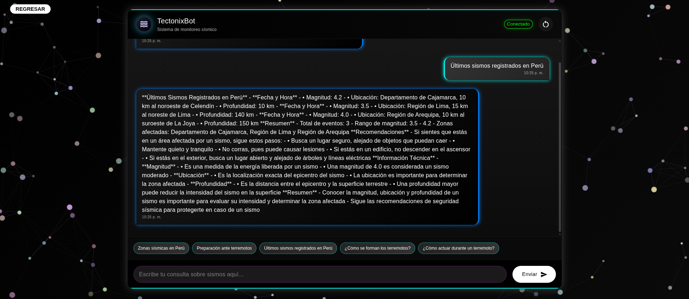
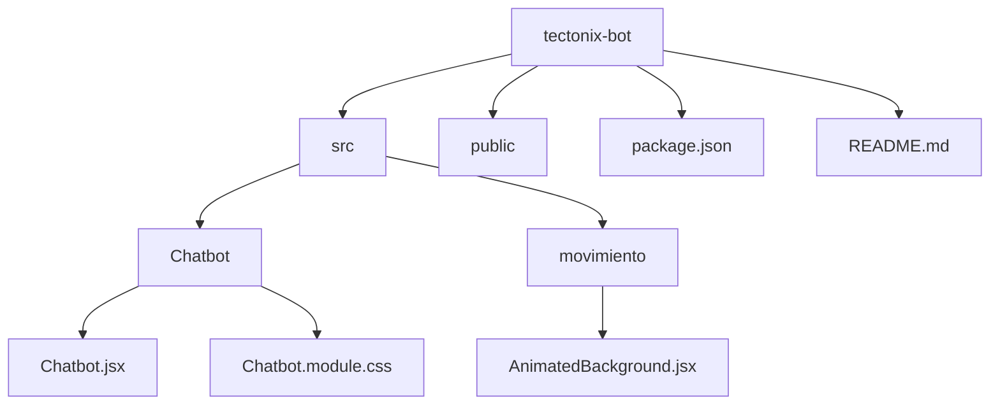

# <div align="center">

  
</div>

<div align="center">
  
  
  
  
  
  
  
</div>

---

---

<div align="center">
  
  
  
</div>

<div align="center">
  
</div>

## 🎉 Enlaces del Proyecto

🔗 [🔬 Entrenamiento del Modelo en Google Colab](https://colab.research.google.com/drive/1qehv0kPQXgdB_oDQ1jzsUQLitgMpm71L?usp=sharing)

🌐 [🌍 BaseURL de la API (Render)](https://web-production-dd640.up.railway.app/api)

💾 [📦 Repositorio Backend (GitHub)](https://github.com/LMD-Mirko/Tectonix.IA-Model)


## 🌟 Características Principales

<div align="center">
  <table>
    <tr>
      <td align="center">
        
        <br/>
        Interfaz de chat moderna y responsiva
      </td>
      <td align="center">
        
        <br/>
        Efectos de neón y animaciones
      </td>
      <td align="center">
        
        <br/>
        Fondo animado interactivo
      </td>
    </tr>
    <tr>
      <td align="center">
        
        <br/>
        Sistema inteligente de consultas
      </td>
      <td align="center">
        
        <br/>
        Monitoreo en tiempo real
      </td>
      <td align="center">
        
        <br/>
        Adaptable a todos los dispositivos
      </td>
    </tr>
  </table>
</div>

## 🚀 Tecnologías Utilizadas

<div align="center">
  <table>
    <tr>
      <td align="center">
        <h3>Frontend</h3>
        
        
        
        
      </td>
    </tr>
    <tr>
      <td align="center">
        <h3>Backend</h3>
        
        
        
      </td>
    </tr>
  </table>
</div>

## 🎮 Demostración

<div align="center">
  
  
  [](https://tectonix-bot-demo.com)
</div>

## 🛠️ Instalación

<div align="">
  
</div>

```bash
git clone https://github.com/tu-usuario/tectonix-bot.git
cd tectonix-bot
```

<div align="">
  
</div>

```bash
npm install
```

<div align="">
  
</div>

```bash
cp .env.example .env
```

<div align="">
  
</div>

```bash
npm run dev
```

## 📝 Estructura del Proyecto



## 🎨 Características de la Interfaz

### Diseño Moderno

<div align="center">
  <table>
    <tr>
      <td align="center">
        
        <br/>
        Fondo animado con partículas interactivas
      </td>
      <td align="center">
        
        <br/>
        Efectos de neón en elementos clave
      </td>
    </tr>
    <tr>
      <td align="center">
        
        <br/>
        Paleta de colores futurista
      </td>
      <td align="center">
        
        <br/>
        Animaciones suaves y responsivas
      </td>
    </tr>
  </table>
</div>

### Funcionalidades del Chat

<div align="center">
  <table>
    <tr>
      <td align="center">
        
        <br/>
        Mensajes con marca de tiempo
      </td>
      <td align="center">
        
        <br/>
        Indicador de escritura
      </td>
    </tr>
    <tr>
      <td align="center">
        
        <br/>
        Sugerencias de consultas
      </td>
      <td align="center">
        
        <br/>
        Botón de reinicio de conversación
      </td>
    </tr>
  </table>
</div>

## 🔧 Configuración

### Variables de Entorno

```env
VITE_API_URL=http://localhost:3001/api
```

## 🤝 Contribución

<div align="center">
  
  
  
  
  
</div>

## 📄 Licencia

Este proyecto está bajo la Licencia MIT - ver el archivo [LICENSE.md](LICENSE.md) para más detalles.

## 👥 Autores

<div align="center">

<table>
  <tr>
    <td align="center">
      <b>Camila Fuentes Rivera</b><br/>
      <a href="https://github.com/camilafrm" target="_blank">
        
      </a>
    </td>
    <td align="center">
      <b>Mirko Ramos Limas</b><br/>
      <a href="https://github.com/LMD-Mirko" target="_blank">
        
      </a>
    </td>
  </tr>
  <tr>
    <td align="center">
      <b>Shandler Moscoso Reyes</b><br/>
      <a href="https://github.com/SMR1011" target="_blank">
        
      </a>
    </td>
    <td align="center">
      <b>Kenneth Solis Carlos</b><br/>
      <a href="https://github.com/Kenneths-c" target="_blank">
        
      </a>
    </td>
  </tr>
</table>

</div>

## 🙏 Agradecimientos

<div align="center">
  
  
  
</div>

---

<div align="center">
  
  <br/>
  
</div>
